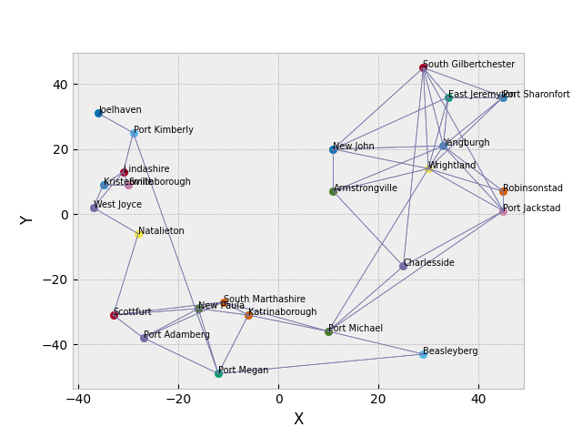

# Pathfinding algorithms implementation

Neste trabalho analisamos o desempenho dos principais algoritmos de busca da literatura no problema de mapas.

O problema de mapas consiste em encontrar o caminhos mais curto (com menor custo) entre dos pontos de um mapas.

Foi implementado uma classe de grafo para a representação dos mapas, além de um gerador de instâncias para a realização dos experimentos.

Os algoritmos são executados para mapas como este:

In this work we analyze the performance of the main search algorithms in the literature on the map problem.

The problem consists of finding the shortest path (with the lowest cost) between two points on a map.

A graph class for the representation of maps was implemented, as well as a random instance generator to carry out the experiments.

Instance example:

## Algorithms

Implemented algorithms:

- Irrevogável;

- Backtracking;

- Breadth-first search;

- Depth-first search;

- Busca Ordenada;

- A\*;

- IDA\*

## Execução

Para rodar executar o programa basta acessar o terminal na pasta do projeto e executar o comando:

`python main.py`

e o programa irá rodar todos os algoritmos de busca 10 vezes para cada instância, sendo essas de tamanho 25, 50, 100 e 200. Os resultados serão armazenados em "results.csv" na pasta "outputs".
